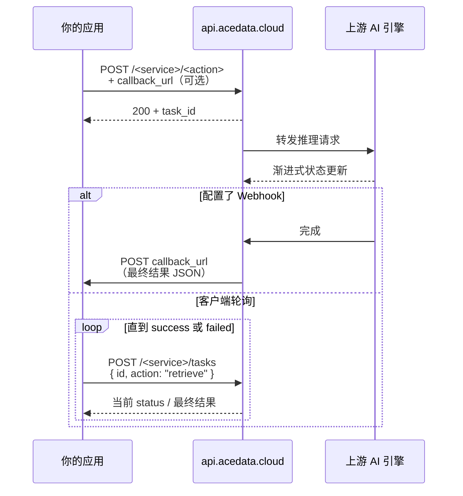
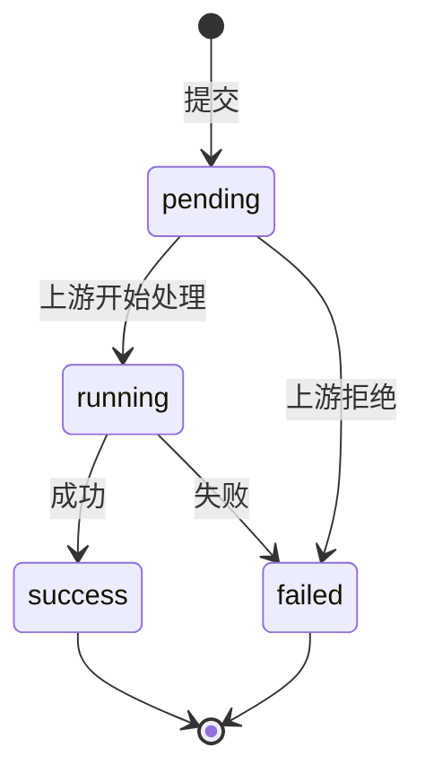

大部分图像 / 视频 / 音乐生成接口都是**异步任务**——上游推理通常需要几秒到几分钟，请求不会立刻返回成品。我们提供两种结果获取方式：**轮询**与 **Webhook 回调**。本页统一讲清这两种模式的用法。

## 核心流程



## 提交任务

所有生成端点都接受相同的可选字段：

| 字段 | 类型 | 说明 |
|---|---|---|
| `callback_url` | `string` | **推荐配置**。任务完成后我们 POST 完整结果到此 URL |
| `callback_secret` | `string` | 可选。我们会带上 `X-Callback-Signature: HMAC-SHA256(secret, body)` 头，用于验签 |
| `timeout` | `number` | 同步等待秒数；超时则返回 `task_id`，转入异步模式 |

返回总会包含 `task_id`（即使同步直出，也保留它）：

```json
{ "success": true, "task_id": "..." }
```

## 方案 A：Webhook 回调（推荐）

**为什么推荐**：节省轮询次数和成本，延迟低，对服务器友好。

### 1. 实现 Webhook 接收端

```python
from fastapi import FastAPI, Header, Request, HTTPException
import hashlib, hmac

app = FastAPI()
SECRET = b"your-callback-secret"

@app.post("/webhook/acedata")
async def receive(req: Request,
                  x_callback_signature: str = Header(None)):
    body = await req.body()
    expected = hmac.new(SECRET, body, hashlib.sha256).hexdigest()
    if not hmac.compare_digest(expected, x_callback_signature or ""):
        raise HTTPException(401, "invalid signature")
    payload = await req.json()
    # payload 结构与轮询返回完全一致
    task_id = payload["task_id"]
    if payload.get("success"):
        # 处理成品 URL / 字段
        ...
    else:
        # 处理失败
        ...
    return {"ok": True}
```

### 2. 调用时带上 callback_url

```bash
curl -X POST https://api.acedata.cloud/sora/videos \
  -H "Authorization: Bearer YOUR_API_TOKEN" \
  -H "Content-Type: application/json" \
  -d '{
    "prompt": "an astronaut surfing on a comet",
    "callback_url": "https://your-server.com/webhook/acedata",
    "callback_secret": "your-callback-secret"
  }'
```

### Webhook 行为约定

- **重试**：HTTP 非 2xx 响应触发重试，最多 5 次，退避 1m → 5m → 30m → 2h → 6h
- **幂等**：以 `task_id` 为唯一键去重，避免重复入库
- **超时**：你的 Webhook 必须在 **10 秒**内返回 2xx
- **不要做重活**：在 Webhook 里只入队，业务处理走自己的 worker

## 方案 B：客户端轮询

如果没有公网可访问的 Webhook 地址（开发环境、移动端、桌面应用），改用轮询：

```python
import time, requests

def wait_for_task(service, task_id, token, interval=5, max_wait=600):
    """通用任务轮询。"""
    url = f"https://api.acedata.cloud/{service}/tasks"
    deadline = time.time() + max_wait
    while time.time() < deadline:
        r = requests.post(
            url,
            headers={"Authorization": f"Bearer {token}"},
            json={"id": task_id, "action": "retrieve"},
            timeout=30,
        ).json()
        status = r.get("status")
        if status == "success" or r.get("success") is True:
            return r
        if status == "failed" or r.get("success") is False:
            raise RuntimeError(r.get("error", {}).get("message", "task failed"))
        time.sleep(interval)
    raise TimeoutError(f"task {task_id} did not finish in {max_wait}s")
```

### 轮询节奏建议

| 服务类型 | 推荐间隔 | 一般完成时间 |
|---|---|---|
| 文本生成（Chat）| - | 同步直出，不需要轮询 |
| 图像生成（Midjourney、Flux）| 3–5 秒 | 10–60 秒 |
| 视频生成（Sora、Veo、Kling）| 10–15 秒 | 1–5 分钟 |
| 音乐生成（Suno、Producer）| 5–10 秒 | 30–120 秒 |

<Note>
  轮询本身**不消耗额度**——`/tasks` 接口免费。但请合理控制频率，过密轮询可能触发 429。
</Note>

## 状态机



| 状态 | 客户端动作 |
|---|---|
| `pending` | 继续轮询 / 等 Webhook |
| `running` | 继续轮询 / 等 Webhook |
| `success` | 读取最终字段（URL、文本等），停止轮询 |
| `failed` | 读 `error` 字段，**不要重新轮询**——发起新任务或上报 |

## 推荐架构

<CardGroup cols={2}>
  <Card title="生产环境" icon="circle-check">
    Webhook + 任务表持久化 + 幂等键，配合 worker 队列异步处理
  </Card>
  <Card title="原型 / 内部工具" icon="flask">
    直接同步等待（合理设置 `timeout`），失败重试一次
  </Card>
  <Card title="移动端 / 桌面端" icon="mobile">
    短轮询（间隔 5–10s），结果落地到本地 SQLite
  </Card>
  <Card title="高吞吐批处理" icon="layer-group">
    并发提交 + Webhook 收成果，避免轮询风暴
  </Card>
</CardGroup>

## 故障排查

- 任务卡在 `pending` 超过 10 分钟：上游可能积压，参考 [并发与速率](/faq/concurrency)
- Webhook 没收到：检查 URL 是否能从公网访问（**不能是 localhost / 内网 IP**），TLS 是否有效
- Webhook 签名校验失败：确认 `callback_secret` 一致、签名算法是 HMAC-SHA256 over **raw body bytes**
- 拿到 `task_id` 后 24h 内查询不到：任务可能已经清理。**记录 task_id 后请尽早处理结果**

详细错误码参考 [统一响应格式](/concepts/responses)。
