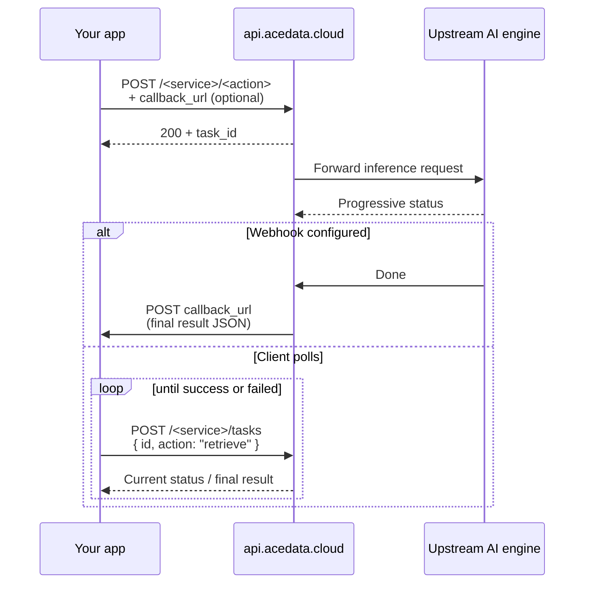
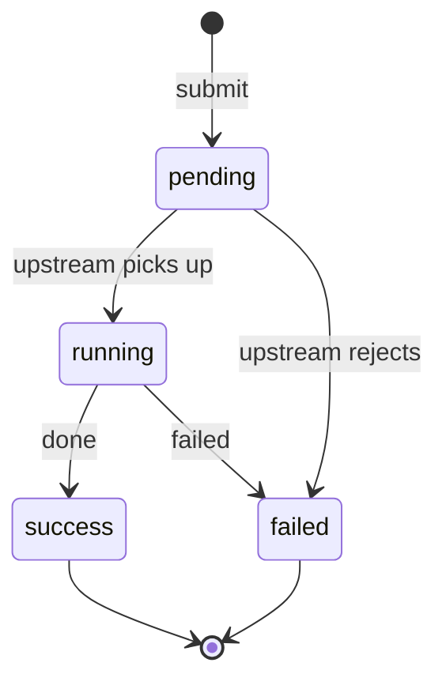

Most image / video / music generation APIs are **asynchronous** — upstream inference takes seconds to minutes, so requests don't immediately return the finished asset. There are two ways to collect results: **polling** and **webhook callbacks**.

## Core Flow



## Submitting a Task

All generation endpoints accept the same optional fields:

| Field | Type | Note |
|---|---|---|
| `callback_url` | `string` | **Recommended**. We POST the final result to this URL |
| `callback_secret` | `string` | Optional. We sign body with `X-Callback-Signature: HMAC-SHA256(secret, body)` |
| `timeout` | `number` | Seconds to wait synchronously; on timeout we return `task_id` |

Every response contains `task_id`:

```json
{ "success": true, "task_id": "..." }
```

## Option A: Webhook Callbacks (Recommended)

**Why**: zero polling, lower latency, server-friendly.

### 1. Implement a webhook receiver

```python
from fastapi import FastAPI, Header, Request, HTTPException
import hashlib, hmac

app = FastAPI()
SECRET = b"your-callback-secret"

@app.post("/webhook/acedata")
async def receive(req: Request,
                  x_callback_signature: str = Header(None)):
    body = await req.body()
    expected = hmac.new(SECRET, body, hashlib.sha256).hexdigest()
    if not hmac.compare_digest(expected, x_callback_signature or ""):
        raise HTTPException(401, "invalid signature")
    payload = await req.json()
    # Shape identical to polling response
    task_id = payload["task_id"]
    if payload.get("success"):
        # Handle finished asset
        ...
    else:
        # Handle failure
        ...
    return {"ok": True}
```

### 2. Pass callback_url on submit

```bash
curl -X POST https://api.acedata.cloud/sora/videos \
  -H "Authorization: Bearer YOUR_API_TOKEN" \
  -H "Content-Type: application/json" \
  -d '{
    "prompt": "an astronaut surfing on a comet",
    "callback_url": "https://your-server.com/webhook/acedata",
    "callback_secret": "your-callback-secret"
  }'
```

### Webhook Conventions

- **Retries**: Non-2xx triggers retry, up to 5 attempts, backoff 1m → 5m → 30m → 2h → 6h
- **Idempotency**: Deduplicate on `task_id`
- **Timeout**: Your webhook must return 2xx within **10 seconds**
- **Keep it light**: Enqueue and ack; do heavy work in your own worker

## Option B: Client Polling

When you don't have a public webhook endpoint (dev, mobile, desktop):

```python
import time, requests

def wait_for_task(service, task_id, token, interval=5, max_wait=600):
    url = f"https://api.acedata.cloud/{service}/tasks"
    deadline = time.time() + max_wait
    while time.time() < deadline:
        r = requests.post(
            url,
            headers={"Authorization": f"Bearer {token}"},
            json={"id": task_id, "action": "retrieve"},
            timeout=30,
        ).json()
        status = r.get("status")
        if status == "success" or r.get("success") is True:
            return r
        if status == "failed" or r.get("success") is False:
            raise RuntimeError(r.get("error", {}).get("message", "task failed"))
        time.sleep(interval)
    raise TimeoutError(f"task {task_id} did not finish in {max_wait}s")
```

### Recommended Polling Cadence

| Service type | Interval | Typical completion |
|---|---|---|
| Text (Chat) | — | Sync, no polling needed |
| Image (Midjourney, Flux) | 3–5 s | 10–60 s |
| Video (Sora, Veo, Kling) | 10–15 s | 1–5 min |
| Music (Suno, Producer) | 5–10 s | 30–120 s |

<Note>
  Polling itself **doesn't consume credits** — `/tasks` is free. But excessive polling may trip 429.
</Note>

## State Machine



| State | Client action |
|---|---|
| `pending` | Keep polling / wait for webhook |
| `running` | Keep polling / wait for webhook |
| `success` | Read final fields (URLs, text), stop polling |
| `failed` | Read `error`, **don't re-poll** — submit a new task or report |

## Recommended Architectures

<CardGroup cols={2}>
  <Card title="Production" icon="circle-check">
    Webhook + task table + idempotency keys, with worker queue
  </Card>
  <Card title="Prototype / Internal" icon="flask">
    Sync with sensible `timeout`, retry once on failure
  </Card>
  <Card title="Mobile / Desktop" icon="mobile">
    Short polling (5–10 s), persist to local SQLite
  </Card>
  <Card title="High-throughput Batch" icon="layer-group">
    Concurrent submit + webhook collection (avoid polling storms)
  </Card>
</CardGroup>

## Troubleshooting

- Task stuck `pending` > 10 min: upstream backlog. See [Concurrency](/en/faq/concurrency)
- Webhook never received: URL must be publicly reachable (**not localhost or private IP**), TLS valid
- Webhook signature mismatch: confirm `callback_secret` matches and signature is HMAC-SHA256 over **raw body bytes**
- `task_id` unknown after 24h: tasks may be cleaned up. **Process the result promptly**

Full error code list in [Response Format](/en/concepts/responses).
